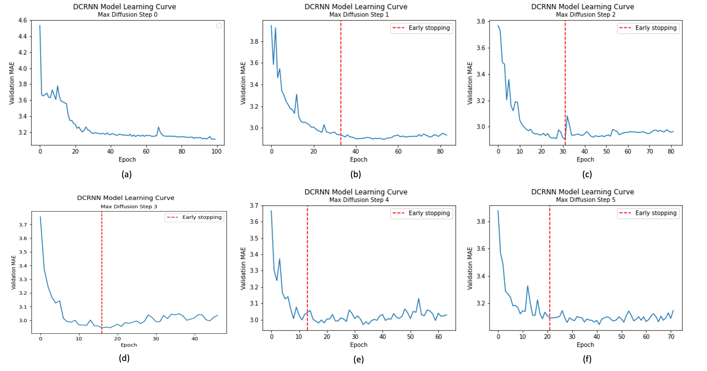
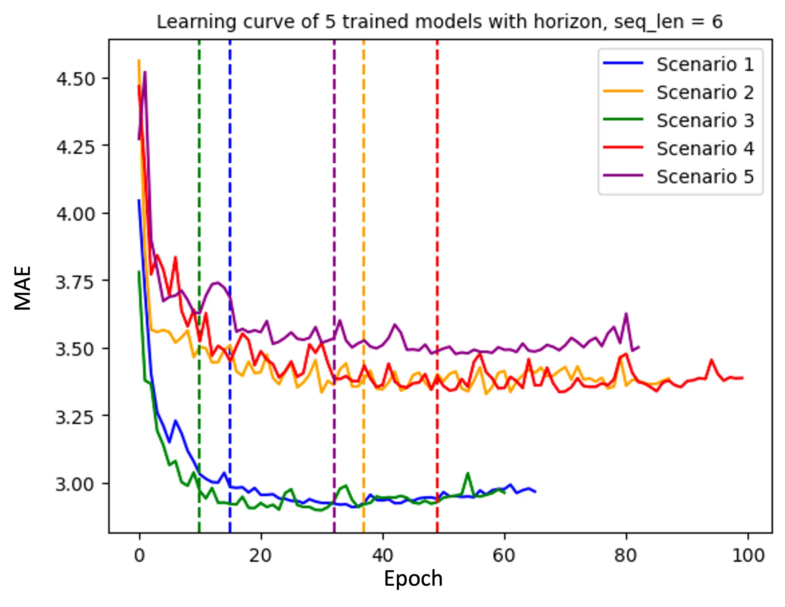

Link to the original blog post: https://medium.com/@saeedrmd/revisiting-dcrnn-diffusion-convolutional-recurrent-neural-network-data-driven-traffic-forecasting-caeecbe3281b
# Revisiting DCRNN: Diffusion Convolutional Recurrent Neural Network: Data-Driven Traffic Forecasting

## Introduction

In this blog post, we revisit the DCRNN model, proposed in the paper “Diffusion
Convolutional Recurrent Neural Network: Data-Driven Traffic Forecasting,”¹ by
reproducing the model in PyTorch, evaluating it, testing its hyperparameters, and
conducting two ablation studies.

The paper introduces a promising new approach to traffic forecasting, which is
especially useful in the context of large metropolitan areas. With highly complex
traffic patterns and a large number of roadways and intersections, these areas
present significant challenges for traditional forecasting methods, such as time


series and traditional convolutional-based deep learning models. In response, the
DCRNN model combines a diffusion convolutional layer with a recurrent neural
network to capture both spatial and temporal dependencies in traffic patterns. This
innovative combination of techniques allows for more accurate and reliable
predictions, as demonstrated through several experiments conducted by the
authors. These experiments show that the DCRNN model can achieve excellent
performance on real-world traffic forecasting tasks, making it an attractive option
for engineers and transportation planners.

The purpose of this post is to reproduce the PyTorch implementation of DCRNN in
order to evaluate its performance in different setups, including its sensitivity to
hyperparameter selection, sensor location and network setup, and some ablation
studies. The implementation is based on a GitHub repository from Chintan Sha:
chnsh/DCRNN_PyTorch: Diffusion Convolutional Recurrent Neural Network
Implementation in PyTorch (github.com)

## What is DCRNN?

The DCRNN model is composed of two primary components: the diffusion
convolutional layer and the recurrent layer. The diffusion convolutional layer
captures the spatial dependencies by modeling the diffusion process on a graph,
thereby taking into account the complex relationships between different traffic
sensors. The graph is constructed based on the pairwise distances between sensors,
with adjacency matrices serving as the diffusion operators. The recurrent layer, on
the other hand, is responsible for modeling the temporal dependencies by utilizing
a gated recurrent unit (GRU) or long short-term memory (LSTM) cell, which can
effectively capture long-range temporal patterns in the data. The authors also
propose a regularization technique called scheduled sampling, which aids in
mitigating the exposure bias problem that arises due to discrepancies between the
training and inference stages. This technique allows the model to maintain the
consistency of the predicted and ground truth sequences during training, resulting
in improved forecasting performance.


The model begins with an input layer that takes the raw traffic data, which is
typically represented as a time-series matrix. This matrix captures the traffic speed,
volume, or occupancy measurements from multiple sensors in the network over
time. The input data is then fed into the diffusion convolutional layer. The diffusion
convolutional layer utilizes graph-based convolution operations to capture spatial
dependencies in the traffic data. The layer constructs a graph based on the physical
locations of traffic sensors, and the edges represent the pairwise distances between
sensors. The graph is then used to compute the adjacency matrices, which serve as
diffusion operators. By applying these operators, the diffusion convolutional layer
effectively models the spread of traffic information across the network.

Following the diffusion convolutional layer, the model incorporates a recurrent
layer to capture temporal dependencies. The recurrent layer consists of a sequence
of GRU or LSTM cells, both of which are capable of modeling long-range temporal
patterns in the data. These cells maintain hidden states that allow them to
remember previous time steps, thereby enabling the model to learn and predict
how traffic conditions change over time.

Finally, the DCRNN model employs a fully connected output layer to generate the
final traffic predictions. This layer combines the information gathered from the
diffusion convolutional and recurrent layers and produces forecasts for each traffic
sensor in the network. Overall, the DCRNN’s modular and hierarchical structure,
along with its incorporation of both spatial and temporal dependencies, allows it to
effectively model and predict complex traffic patterns.

## Traffic Network

The authors employ two real-world traffic networks to evaluate the performance of
their proposed model. These networks are the Los Angeles (also known as METR-
LA) and the San Francisco Bay Area (also known as PeMS-Bay) traffic networks.

For the sake of this blog post, all the analyses are done based on the network in LA.
The main reason for choosing the METR-LA dataset is that there already exists a
pre-trained model in the corresponding repository², and training a whole model was
not feasible based on the available time and budget. The METR-LA network and the
location of the sensors on the network are illustrated in Figure 1. As can be seen, the


network consists of a large number of traffic sensors (207 sensors) that continuously
collect traffic data, such as speed, volume, and occupancy. The sensors are
distributed across the road network and are primarily located on highways and
major arterial roads.


```
Figure 1: The location of the sensors on the METR-LA network
```
## Reproducing the DCRNN code in PyTorch

The code from the paper “Diffusion Convolutional Recurrent Neural Network: Data-
Driven Traffic Forecasting” available at https://github.com/chnsh/DCRNN_PyTorch,
was replicated and adapted to function on Google Colab.

### Modifications:

The code was modified to ensure compatibility with the latest version of Python and
the latest library versions. Some deprecated methods from these libraries were
replaced with their new alternatives across all files used. Specifically, the
“.as_matrix()” method from the pandas library was replaced with “.values”.


Additionally, a loader was added to “yaml.load(f, Loader=yaml.Loader)” in place of
the original “yaml.load(f )” from the yaml library.

The code used for the training loop in https://github.com/mehulbhuradia
/DCRNN_PyTorch/blob/mehul/model/pytorch/dcrnn_supervisor.py was modified to
include the MAE, MAPE, RMSE values in the logs.

The training data generation script was modified to work for various subsets of the
original dataset. These subsets were generated by changing the horizon values, the
sequence length, and the set of sensors used. The process of choosing the included
sensors is discussed in detail below under the Ablation Studies section. The updated
script is available at https://github.com/mehulbhuradia/DCRNN_PyTorch
/blob/mehul/generate_training_data_2023.py.

A new .txt file with the chosen sensor ids was also added for each subset of sensors
to create a new adjacency matrix for those sensors.

### Availability:

The adapted code is available as a .ipynb file, which can be accessed at
https://github.com/mehulbhuradia/DCRNN_PyTorch/blob/mehul
/Assignment.ipynb. This notebook includes steps to clone the repository, install the
dependencies, download the dataset, generate training data and an adjacency
matrix for the chosen subset, train the model, test the model, and plot a learning
curve. The config files and sensor_ids.text files were also modified to change the
subset of chosen sensors, the model parameters, and the hyperparameters used for
different runs.

### Important Files:

In this section, we briefly explain the important files and classes in the repository in
order to provide a better understanding of the model.

- generate_training_data_2023.py


```
DCRNN_PyTorch/generate_training_data_2023.py at mehul ·
mehulbhuradia/DCRNN_PyTorch
Diffusion Convolutional Recurrent Neural Network Implementation in
PyTorch ...
github.com
```
This file defines functions for generating training, validation, and testing data for a
graph sequence-to-sequence model. It reads in traffic data from an HDF5 file,
preprocesses it, and saves the resulting data in compressed NumPy files (.npz) in a
specified output directory.

- gen_adj_mx.py

```
DCRNN_PyTorch/gen_adj_mx.py at mehul ·
mehulbhuradia/DCRNN_PyTorch
Diffusion Convolutional Recurrent Neural Network Implementation in
PyTorch - DCRNN_PyTorch/gen_adj_mx.py at mehul ·...
github.com
```
This script calculates an adjacency matrix for a given set of sensor ids and distances.
It reads in sensor ids and distances from the CSV and txt files provided, creates the
adjacency matrix, and saves it to a pickle file. The main function is
get_adjacency_matrix(), which takes a distance DataFrame and a list of sensor ids as
inputs and returns the sensor ids, a dictionary mapping sensor ids to indices, and
the adjacency matrix.

- dcrnn_train_pytorch.py

```
DCRNN_PyTorch/dcrnn_train_pytorch.py at mehul ·
mehulbhuradia/DCRNN_PyTorch
Diffusion Convolutional Recurrent Neural Network Implementation in
PyTorch - DCRNN_PyTorch/dcrnn_train_pytorch.py at...
github.com
```

This code loads a configuration file in YAML format, loads a preprocessed graph
data file, creates a DCRNN model supervisor with the loaded data and
configuration, and trains the model using the supervisor.

- dcrnn_supervisor.py

```
DCRNN_PyTorch/dcrnn_supervisor.py at mehul ·
mehulbhuradia/DCRNN_PyTorch
Diffusion Convolutional Recurrent Neural Network Implementation in
PyTorch - DCRNN_PyTorch/dcrnn_supervisor.py at mehul...
github.com
```
This is a Python class DCRNNSupervisor that implements a DCRNN (Diffusion
Convolutional Recurrent Neural Network) for traffic prediction. The class has
methods for training and evaluating the model.

- dcrnn_model.py

```
DCRNN_PyTorch/dcrnn_model.py at mehul ·
mehulbhuradia/DCRNN_PyTorch
Diffusion Convolutional Recurrent Neural Network Implementation in
PyTorch - DCRNN_PyTorch/dcrnn_model.py at mehul ·...
github.com
```
The three classes defined in the code are EncoderModel, DecoderModel, and
DCRNNModel. The input data comprises a time-series sequence, and the output
data is the prediction of future values of this sequence. The EncoderModel takes the
input data and transforms it into a lower-dimensional feature representation, which
is then utilized by the DecoderModel to generate the output data. Ultimately, the
DCRNNModel combines both models to make the final predictions. DCRNN cells
are used in the DCRNNModel to process the encoded input sequence and generate
the predicted output sequence.


- dcrnn_cell.py

```
DCRNN_PyTorch/dcrnn_cell.py at mehul ·
mehulbhuradia/DCRNN_PyTorch
Diffusion Convolutional Recurrent Neural Network Implementation in
PyTorch - DCRNN_PyTorch/dcrnn_cell.py at mehul ·...
github.com
```
The DCRNN cells are the building blocks of the DCRNNModel and are used to model
the temporal dependencies in the input data. DCGRUCell is a class that incorporates
a Graph Convolutional Network (GCN) and a Gated Recurrent Unit (GRU). The GRU
is a form of Recurrent Neural Network (RNN) that regulates the flow of data within
the network by employing a gating mechanism. The GCN is a neural network that
operates on graph data, where entities are represented by nodes and their
relationships by edges.

## Hyperparameter Checking

Hyperparameter tuning is an essential procedure employed in Machine Learning
with the aim of selecting only the best parameters for a given model. When we say
hyperparameters we refer to those values that cannot be learned or extracted from
training data, and as such, they need to be manually tuned. In this section we will
discuss our experiments involving Horizon and Sequence Length, Learning Rates,
amount of RNN units and Maximum Diffusion Step.

### Horizon and Sequence Length
The Horizon is the number of future time steps that the model tries to predict.
When a model’s Horizon is subject to changes we can expect an impact on accuracy.
A shorter Horizon might be capable of better capturing local trends and short-term
fluctuations, while a higher Horizon can better capture long-term forecasting. In
conjunction with Horizon we also tuned Sequence Length, which is the size of the
input that will be provided to the model.


We decided to test Horizon and Sequence Length for values 1, 6, 18 which
respectively correspond to time steps of 5, 30 and 90 minutes. The average learning
curves for these experiments are depicted in Figure 1.


```
Figure 1. Average learning curve based on 5 trained models with the horizon and sequence values set to a) 1,
b) 6, and c) 18
```
As we can observe in Figure 1, the model with Horizon 1 achieves the best accuracy
while taking more epochs to reach its minimum MAE. In Figures 1.a and 1.b, we can
observe a similar curve behavior, but with a lower accuracy in Horizon 18. What we
can derive from the plots is that, in this specific setting, a lower Horizon can benefit
traffic prediction.

### Learning Rate Decay

The Learning Rate is a crucial parameter to tune as it affects the frequency of
parameter updates in the model. A low learning rate may cause the model to get
stuck in a local minimum without improvement, whereas a high value may result in
unstable results by overshooting optimal parameters. The same set of parameters
were used to create two learning curves for a model, but with different learning rate
decay steps. The first curve, shown in figure 2.a, had a more frequent learning rate
decay schedule (5,10,15,20,25) and started much earlier compared to the second
curve shown in figure 2.b (20,30,40,50). The curve in Figure 1.a shows a smooth
increase in accuracy over the training period, while the curve in Figure 2.b shows a
more erratic increase in accuracy over the training period.

Upon analyzing these curves, it was observed that starting the decay schedule
earlier and making it more frequent resulted in a smoother learning curve and an
improvement in the model’s accuracy.


```
Figure 2. a) The learning curve for a model with a more frequent learning rate decay schedule. The learning
rate decay steps are at epochs 5, 10, 15, 20, and 25. b) The learning curve for a model with a less frequent
learning rate decay schedule. The learning rate decay steps are at epochs 20, 30, 40, and 50.
```
### Number of RNN Units

The RNN unit is designed to allow the network to maintain a memory of previous
inputs and use this memory to inform its predictions for future inputs. A high
number of RNN units can improve the model’s ability to capture long-term
dependencies and patterns in the data but it might increase the complexity of the
model and can lead to overfitting.

We decided to test for 32 and 128 RNN units. As we can observe in Figures 3.a and
3.b, while 128 RNN units achieved slightly better accuracy, the results are
comparable overall. We can infer that a higher amount of RNN units might not be
necessary for this specific setting and lowering the complexity of the model for
similar results might be favorable.


```
Figure 3. The learning curves for models with a) 32 and b) 128 RNN units. The horizon and sequence length
are set to 6
```
### Max Diffusion Step
The Max Diffusion Step determines the maximum number of iterations or diffusion
steps that the model performs during training. Increasing the max diffusion step
can lead to a more accurate model by allowing the diffusion process to continue for
a longer time and allowing more complex patterns to emerge in the data. However,
increasing the max diffusion step also increases the computational complexity of
the model and can make training more difficult, as the model needs to balance the
trade-off between capturing complex patterns and overfitting to the training data.
In our case Max Diffusion Step determines the distance of other sensors that are
queried for de-noising, with 0 being none. We tested values 0, 1, 2, 3, 4 and 5 for
Maximum Diffusion Step.


```
Figure 4. Max Diffusion Steps of a) 0, b) 1, c) 2, d) 3, e) 4, f) 5.
```
As we can observe in Figure 4, the Max Diffusion Step has to be set to a sweet spot. 0
appears to perform the worst with very erratic data. Higher values such as 4 and 5
are also quite imprecise, we can assume that more distant sensors might produce
unrelated data.

## Ablation Studies

### Ablation Study 1 | Reducing the network size

In the first ablation study, we reduced the number of sensors in the network (and
correspondingly in the graph) to 20 and retrained the model using the new sensor
network. The main purpose was to see how sensitive is the model to the size of the
network, and what would happen if we train a model on a very local sensor network.
Will it increase or decrease the performance of the model significantly, or the model
is not very much dependent on the number of the sensors?

For this purpose, we first plotted the sensors on the map of the study area using
QGIS and then chose 20 sensors from the east-southern part of the study area. The
location of the chosen sensors is depicted in Figure 5.


```
Figure 5. The location of selected 20 sensors for ablation study 1
```
After running the models with the same setup for the original 207 sensors, as well as
for the reduced 20 sensors, we got a small improvement in the MAE values for the
scenario with 20 sensors. The corresponding MAE values for the original 207
sensors and the reduced 20 sensors are 3.15 and 2.66, respectively. This shows that
probably reducing the number of sensors, given that the sensors are still in a
relatively local area, does not result in lower performance, but may even increase
the accuracy of the results. This might be due to the fact that the heterogeneity in
traffic flows and speeds is more prevalent when we have a larger network, which
makes it more challenging for the model to capture the spatial correlations and
make accurate predictions for the whole large network. Accordingly, probably using
smaller networks that consist of local sensors is more promising in predicting
traffic flows and speeds. However, there should be a balance between the size of the
network and the desired accuracy for the specific problem. Recently, one
interesting paper suggested how we can define lower bounds for the predictability
of traffic [3, 4]. These theoretical insights could also be useful for defining the size of
the network when developing graph-based deep learning models.


However, this analysis does not tell the whole story. What if we had chosen another
20 sensors from another part of the network? Would the results still be the same?
How about if we had chosen random sensors? To answer these questions, we did
another ablation study, this time using different setups for the sensors. In the next
section, we briefly overview this experiment.

### Ablation Study 2 | Repositioning and Sensor Selection
As it was mentioned in the previous section, in order to analyze the sensitivity of the
results (model) against the sensors’ location and sensor distances, we did another
study repositioning the selected 20 sensors to different regions of the study area.
This study includes the next five scenarios:

- Scenario 1: Training and evaluating the model on the original 20 sensors
    selected from the east-southern part of the network

This scenario was defined based on the ablation study and is used as a benchmark
for the other 4 scenarios. The location of the selected sensors are depicted using red
dots in Figure 6.


```
Figure 6. Location of selected sensors for Scenario 1
```

- Scenario 2: Training and evaluating the model on the original 20 sensors
    selected from the north-western part of the network

In this scenario, instead of choosing the sensors from the easter part of the network,
we chose the sensors from the western part. We were interested to see if the model
would still produce accurate results for a different area, with probably a different
traffic pattern and dependencies. The location of the selected sensors for scenario 2
are depicted using red dots in Figure 7.


```
Figure 7. Location of selected sensors for Scenario 2
```
- Scenario 3: Training and evaluating the model on the original 20 sensors
    selected from the east-northern part of the network, but this time sensors with
    farther distance from each other compared to scenario 1

In this scenario, we chose the sensors from the same area as the scenario 1, but
instead of choosing the very adjacent sensors, we chose the sensors in a bi-selection
manner, which means we chose one sensor, ignored its instant neighbors, and then
chose the instant neighbors of its neighbors. With this selection approach, we were
interested to see in the model is sensitive to the distance between the sensors. The
location of the selected sensors for scenario 3 are depicted using red dots in Figure 8.


```
Figure 8. Location of selected sensors for Scenario 3
```
- Scenario 4: Training and evaluating the model on 20 random sensors from the
    network

In this scenario, we chose a totally random sensors in the network. The aim was to
see if the model is sensitive to the density of the sensors and if it really matters that
the sensors are close to each other and from the same area. The location of the
selected sensors are depicted using red dots in Figure 9.


```
Figure 9. Location of selected sensors for Scenario 4
```
- Scenario 5: Training and evaluating the model on another 20 random sensors
    from the network

This scenario is similar to scenario 4, but with a different random selection. The
selected sensors are depicted in Figure 10.


```
Figure 10. Location of selected sensors for Scenario 5
```
After training and evaluating the models for the discussed scenarios, learning
curves based on MAE values were used in order to evaluate the performance of the
models. It is worth mentioning that since the sensors are on highways, the speed
limit for the whole area is the same and therefore, using MAE is not expected to
have a high impact on the comparability of the results.

Figure 11 shows the learning curves for the 5 discussed scenarios. As can be seen,
the learning process and the final MAE values for scenarios 1 and 3 are significantly
better and lower than the corresponding curves and MAE values for the other
scenarios. The interesting point here is that the results for scenario 2 (sensors from
north-eastern part of the network) are almost similar to the results for scenarios 4
and 5, which are the scenarios with a random selection of sensors. This basically
shows that the model is very sensitive to the location of sensors, and if we choose
even non-random and local sensors from another part of the network, the results
could be significantly different. This is very important because a prediction model
should be transferable to other new areas with minimum amount of effort.
However, these two studies (the ablation and repositioning ones) showed that not
only changing the network size could significantly affect the results, but also the
location and the selection of the sensors could have an impact on the accuracy of
the model.


```
Figure 11. Learning curves against MAE values for the 5 scenarios
```
## Sensitivity Study

In the study presented in “DCRNN: Data-Driven Traffic Forecasting”, the author’s
experimental setup takes into account multiple settings of horizon prediction and
compares the traffic speed forecasting against other state-of-the-art methods and
the historical average. While the performance increase is noticeable, especially
when the forecast horizon is higher, it is unclear whether the proposed neural
network architecture can reliably replicate the results with minimal variance.

In order to address this issue, we have decided to perform a sensitivity analysis test
using their training routine. This is done by creating 5 models each for sets of
configurations containing different values for the sequence length and horizon
parameters. We have thus assigned these hyperparameters units of 1 , 6 , and 18 ,
where a unit is 5 minutes (Figures 12.a, 12.b, and 12.c, respectively). Other hyper
parameters that were available, such as learning rate, remained identical across
runs. With the aim of visualising the results of our experiment, we calculated the
average learning curve for each test scenario, as displaying 5 overlapping curves
would impede analysis. Consequently, we attempted to showcase the spread of the
data along the models by computing the interquartile range(IQR) in each epoch.


```
Figure 12: Average learning curve composed of MAE scores of the 5 models trained with: a) horizon and
sequence length = 1, b) horizon and sequence length = 6, and c) horizon and sequence length = 18
```
In the figures above, we have decided to cut off the learning curves, stripping them
up until the model that converged the fastest. This is done in order to preserve the
correctness of our computations. As it can be seen, the IQR values are quite low,
suggesting that the data is tightly clustered around the median. The spread seems to
be larger in the beginning epochs for all cases. In particular, for horizon = 1 in
Figure 12.a, the learning curve exhibits greater variability. It can clearly be noticed
in Figures 12.b and 12.c respectively, that the training routine converges quite
quickly, around the 30th epoch, with similar performance. We have also computed
the mean and variance of the MAE values used to compute the curve, but also of the
epochs that the models converged. The results are as follows:


```
Table 1: Table of the models for pairs of (horizon, seq_len) = {(1,1), (6,6), (18,18) with computed metrics for their
curves.
```
Our earlier findings regarding the first model are confirmed by inspecting the
values in Table 1. The models do not early stop and run for the full duration,
meaning that the training process has issues reaching its desired minimum, by overshooting.
This can be caused by too large of a learning rate. Still, the MAE score is the best out of
the models we have tried, likely due to the fact that it is the easiest to predict only 5 minutes
into the future. Conclusively, the standard deviation between the MAE values retrieved through
early stopping, solidifies the claim that the training method employed is robust.

By displaying the performance of these models on the test set, we set out to improve
the validity of the conclusions in the paper. As such, we validated the consistency of
the established training setup, by illustrating the small differences in converged
results and overall learning curves.

## Conclusion

In this report, we reproduced and evaluated the DCRNN model from different
aspects. Firstly, we evaluated the code by addressing its errors and issues and then,
introduced and analyzed its important functions and classes. Then, we did a
hyperparameter testing over horizon and sequence length, learning rate decays,
number of RNN units, and maximum diffusion steps. Afterwards, we did an ablation
study by removing part of the network to see how if affects the accuracy of the
model. We also did another study by repositioning the selected sensors to different
parts of the studied area in 5 different scenarios to identify how the location of sensors
and their distance can affect the model’s accuracy. Finally, due to the shortcoming in the
original paper, we did a sensitivity analysis to see how robust are the results and how sensitive
is the model against different runs of the same scenarios with the same settings.

## Contributions

Mehul: Reproducing Study and Code Analysis

Max: Hyperparameter Testing

Saeed: Ablation Study 1 and 2 (Sensors selection and repositioning)

Rares: Sensitivity Analysis

## References:

[1] Li, Y., Yu, R., Shahabi, C., & Liu, Y. (2017). Diffusion convolutional recurrent
neural network: Data-driven traffic forecasting. arXiv preprint arXiv:1707.01926.

[2] GitHub Repository: chnsh/DCRNN_PyTorch: Diffusion Convolutional Recurrent
Neural Network Implementation in PyTorch (github.com)

[3] Li, G., Knoop, V. L., & Van Lint, H. (2021). Multistep traffic forecasting by
dynamic graph convolution: Interpretations of real-time spatial correlations.
Transportation Research Part C: Emerging Technologies, 128, 103185.

[4] Li, G., Knoop, V. L., & van Lint, H. (2022). Estimate the limit of predictability in
short-term traffic forecasting: An entropy-based approach. Transportation Research
Part C: Emerging Technologies, 138, 103607.


